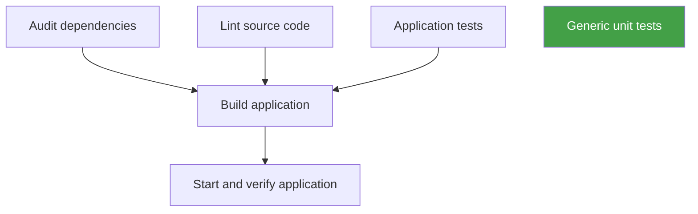

# Vanilla JavaScript SPA

This project is a simple Single Page Application (SPA) built with vanilla JavaScript, HTML, and CSS. It demonstrates basic SPA routing, modular controllers, and dynamic view rendering without any front-end frameworks. The app is bundled with Webpack and styled using Sass and Bootstrap.

## Features
- Home, Posts, and 404 views with client-side routing
- Modular controller structure
- Sass for styling
- Linting and automated tests
- Production-ready build process

## Installation

Install dependencies:
```sh
npm install
```

## Usage

### Development
Start the development server with hot reload and live reloading for rapid development:
```sh
npm start
```
This command uses Webpack Dev Server to serve your app at http://localhost:8080/. Any changes to your source files will automatically reload the app in your browser.

### Production Build
Create an optimized, production-ready build of your app:
```sh
npm run build
```
This command first cleans the `dist` directory, then bundles and minifies your source code using Webpack. The output is placed in the `dist` directory, ready for deployment.

### Cleaning
Remove the `dist` directory and all built files:
```sh
npm run clean
```
This is useful to ensure a fresh build or to clean up build artifacts.

## Scripts

- **start**: Launches the development server with Webpack Dev Server.
- **build**: Cleans and builds the app for production using Webpack.
- **clean**: Removes the `dist` directory.
- **lint**: Runs ESLint on all source files.
- **lint:fix**: Automatically fixes linting issues.
- **lint:check**: Fails if there are any lint warnings.
- **test**: Runs all Node.js tests in the project.
- **test_loader**: Runs tests using a custom HTML loader.
- **test_tap**: Runs tests with the TAP reporter.
- **audit**: Checks for security vulnerabilities in dependencies.
- **audit:fix**: Attempts to automatically fix found vulnerabilities.

## Project Structure

- `src/` — Application source code (controllers, views, styles)
- `test/` — Test files
- `webpack/` — Webpack configuration files


## CI Workflow

**Graph Syntax:**


**Flowchart Syntax:**


## License
ISC
  Fails if there are any lint warnings or errors.